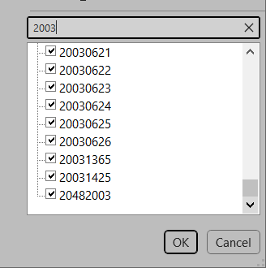

# General Rules When Creating Raw Material Numbers
*Here are some general rules to follow when assigning a new raw material numbers in the Raw Material Cost Database.*

## Every Material Type Has a Prefix

Most material types that are issued a number fall into classes that can be assigned a prefix.  Each class or raw material type that has been assigned a specific prefix can be found on the [Raw Material Prefix Legend](RawMaterialPrefixLegend.md).

> :memo: **Note:**
> When adding a new number to an item on the **Hardware** or **Other** tab, if a prefix has not been assigned for a similar item then the general rule is to use *"2049"* as the prefix. Some general rules when using this prefix can be found below.

---

## Always Use The Highest Number

When assigning a new number within the prefix group, always look for the highest number.
Just be cautious of what the highest number is. In some case you may find that number to be substantially higher than the other numbers around it. You may find that a little research may be necessary to find the next number to use. Here are some tips to use:

### Use the search box within the column filter
This is one of the simplest ways to find a list of prefixes on a particular tab.

*Figure 1: Searching the 2003 prefix in Excel*

In the figure above we see that while searching the *"2003"* prefix there are two numbers that are much greater than the leading group of numbers. Should the next number be in the 0620 group?

### Sort your item numbers
Another simple solution to aligning all the like number together.

### Run a wildcard search in Syteline
This is a great way to confirm the available number within a particular group.

*Figure 2: Performing a wildcard search in Syteline*

In this figure,  wildcard search is being performed on #2003062*, confirming that there is 4 numbers  available within the 20030620 group.

> #### *Exception to this rule..*
> On the **Edgetape** tab, all zero-joint specific, as well as Airtec Specific edge banding uses the **20488000** number group.
> Keep this in mind when issuing new raw material number to edge banding!

---

## 2049 is Used For Many Material Types

When using this prefix, know that it is used on multiple tabs. However it is primarily used on the ***Other RM*** tab. 

Best practice for this prefix is to search for the highest group on the *Other RM* tab.

There are two entries within the *1590* group before the last entry for *1604*.
Before doing a search in Syteline, let's use the **Number Lookup** tab.

Enter *20491590* on the Number Lookup tab and drag-fill the lower cells with the next 10 to 15 numbers. 

As you can see there are 5 available numbers in the 1590 block. This is how to verify an open number before having to do a wildcard search in Syteline.

Let's do a wildcard search for that group in Syteline, search for *2049159**.

As you can see, there are 5 available numbers within this group, so the next new number in this case would be *20491595*. Even though this group was found on the Other RM tab, it should still be used as the next number regardless of which tab this new number will be recorded.

And this bring us to the next rule...

---

## Smart Numbers within Sheet Metal Prefixes
We use a wide variety of sizes and thicknesses when it comes to sheet steel. With that in mind, a smart numbering system was introduced to the sheet metal prefixes several years ago. There are 5 types of sheet steel we typically used here:
- Carbon Steel
- Stainless Steel
- Galvanized
- Galvanneal
- Specialty (Perforated, Peg panel, Expanded Metal, Etc)

With the smart numbering system, each type has 2 prefixes assigned to it. One for 48" wide sheets and the other for 60" wide sheets.

The table below shows these sheet steel prefixes:

| Prefix | Classification                          |
| ------ | --------------------------------------- |
| 1201   | Legacy Sheet Steel                      |
| 1211   | Legacy Sheet Steel                      |
| 1212   | Legacy Sheet Steel                      |
| 1213   | Legacy Sheet Steel                      |
| 1214   | Reserved for 48" Wide Steel Sheets      |
| 1215   | Reserved for 60" Wide Steel Sheets      |
| 1224   | Reserved for 48" Wide Stainless Sheets  |
| 1225   | Reserved for 60" Wide Stainless Sheets  |
| 1234   | Reserved for 48" Wide Galvanized Sheets |
| 1235   | Reserved for 60" Wide Galvanized Sheets |
| 1244   | Reserved for 48" Wide Galvanneal Sheets |
| 1245   | Reserved for 60" Wide Galvanneal Sheets |
| 1254   | Reserved for 48" Wide Specialty Sheets  |
| 1255   | Reserved for 60" Wide Specialty Sheets  |
